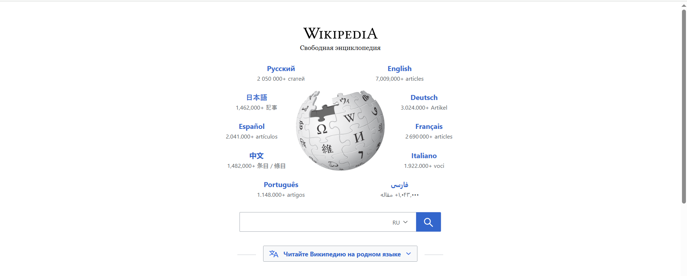

# Проект по автоматизации тестирования Android приложения Wikipedia
<p align="center">

</p>

«Википедия» — многоязычная общедоступная интернет-энциклопедия со свободным контентом.  
[Сайт Wikipedia](https://www.wikipedia.org/)

## :pushpin: Содержание:

- [Технологии и инструменты](#computer-технологии-и-инструменты)
- [Факты о проекте](#clipboard-факты-о-проекте)
- [Примеры автоматизированных тест-кейсов](#heavy_check_mark-примеры-автоматизированных-тест-кейсов)
- [Команды для запуска из терминала](#arrow_forward-команды-для-запуска-из-терминала)
- [Сборка в Jenkins](#-сборка-в-jenkins)
- [Пример Allure-отчета](#-пример-allure-отчета)
- [Уведомления в Telegram с использованием бота](#-уведомления-в-telegram-с-использованием-бота)
- [Видео примера запуска тестов в Selenoid](#clapper-видео-примера-запуска-тестов-в-selenoid)

## :computer: Технологии и инструменты

<p align="center">
<code><a href="https://www.jetbrains.com/idea/"></a></code>
<code><a href="https://www.java.com/"></a></code>
<code><a href="https://gradle.org/"></a></code>
<code><a href="https://junit.org/junit5/"></a></code>
<code><a href="https://selenide.org/"></a></code>
<code><a href="https://github.com/"></a></code>
<code><a href="https://www.jenkins.io/"></a></code>
<code><a href="https://github.com/allure-framework/allure2"></a></code>
<code><a href="https://web.telegram.org/"></a></code>
</p>

Автотесты написаны на `Java` с использованием фреймворков `Appium` и `Selenide`.\
`Gradle` - сборщик проекта.  \
`JUnit5` - для выполнения тестов.\
`Jenkins` - CI/CD для запуска тестов удаленно.\
`Browserstack` - облачная платформа для прогона тестов мобильного приложения.\
`Allure Report` - для визуализации результатов тестирования.\
`Telegram Bot` - для уведомлений о результатах тестирования.\

## :arrow_forward: Команды для запуска из терминала

### *Локальный запуск:*
```
gradle clean test -Dbs_user={userName из аккаунта Browserstack} -Dbs_key={accessKey из аккаунта Browserstack}
```
### *Удалённый запуск через Jenkins:*
```
clean test -DPLATFORM="${PLATFORM}" -DBROWSERSTACK_USER="${BROWSERSTACK_USER}" -DBROWSERSTACK_KEY="${BROWSERSTACK_KEY}"
```
### *Параметры сборки:*

* <code>PLATFORM</code> – платформа Android
* <code>BROWSERSTACK_USER</code> - userName из аккаунта Browserstack
* <code>BROWSERSTACK_KEY</code> - accessKey из аккаунта Browserstack

##  <a href="https://jenkins.autotests.cloud/job/035-katinagon-hw23p2/">Сборка в Jenkins</a>
<p align="center">

</p>

##  <a href="https://jenkins.autotests.cloud/job/035-katinagon-hw23p2/24/allure/">Пример Allure-отчета</a>
### *Основная страница отчёта*

<p align="center">

</p>

### *Тест-кейсы*

<p align="center">

</p>

### *Графики*

<p align="center">

</p>

##  Уведомления в Telegram с использованием бота

После завершения сборки бот в <code>Telegram</code> автоматически обрабатывает и отправляет сообщение с результатом.

<p align="center">

</p>

## :clapper: Видео примера запуска тестов в Selenoid

К каждому тесту в отчете прилагается видео прогона.
<p align="center">
  
</p>

