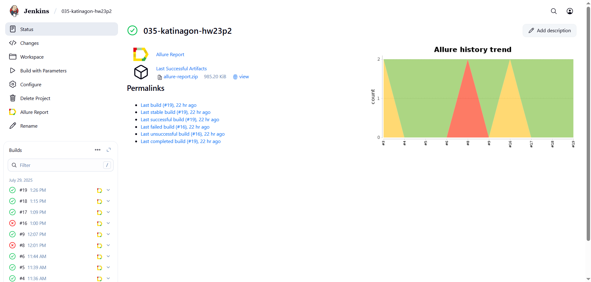
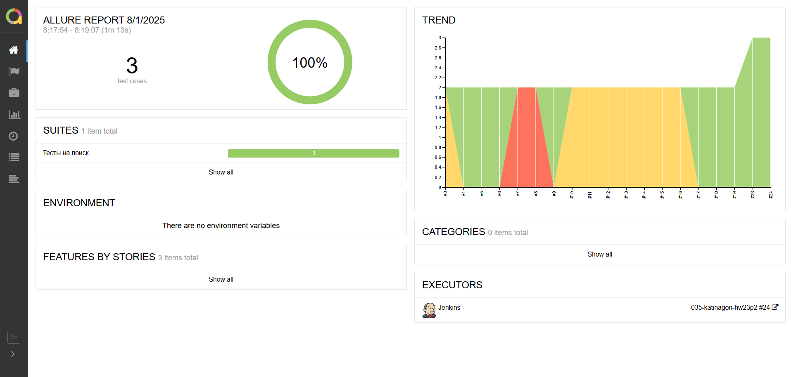
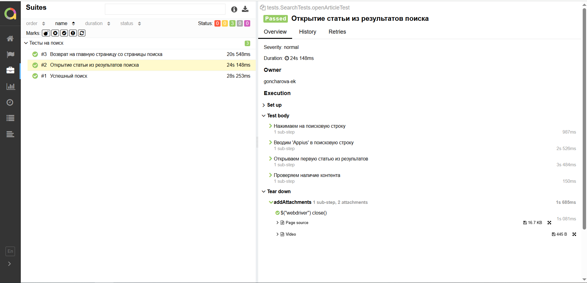
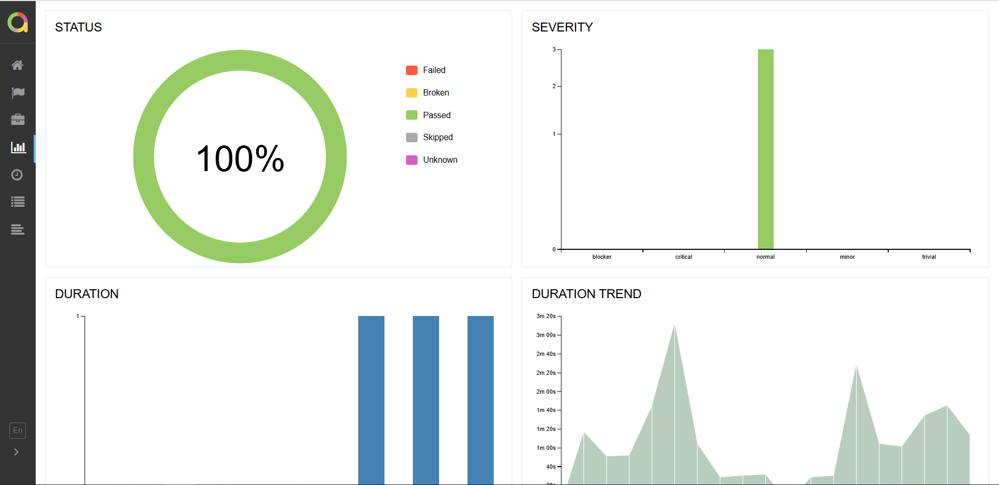
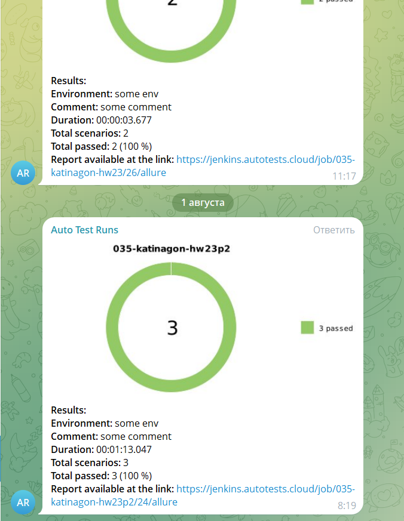
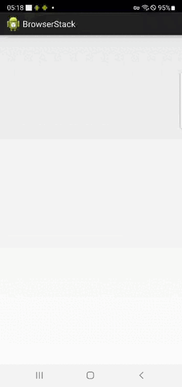

# Проект по автоматизации тестирования сайта "4 лапы"
<p align="center">

</p>

«Четыре Лапы» — одна из крупнейших сетей зоомагазинов и сервисов для заботы о питомцах в России. 
Сеть охватывает широкую сферу товаров и услуг: от покупки премиальных кормов до передержки и ветеринарных услуг.   
[Сайт "4 лапы"](https://4lapy.ru/)

## :pushpin: Содержание:

- [Технологии и инструменты](#computer-технологии-и-инструменты)
- [Факты о проекте](#clipboard-факты-о-проекте)
- [Примеры автоматизированных тест-кейсов](#heavy_check_mark-примеры-автоматизированных-тест-кейсов)
- [Команды для запуска из терминала](#arrow_forward-команды-для-запуска-из-терминала)
- [Сборка в Jenkins](#-сборка-в-jenkins)
- [Пример Allure-отчета](#-пример-allure-отчета)
- [Уведомления в Telegram с использованием бота](#-уведомления-в-telegram-с-использованием-бота)
- [Видео примера запуска тестов в Selenoid](#clapper-видео-примера-запуска-тестов-в-selenoid)

## :computer: Технологии и инструменты

<p align="center">
<code><a href="https://www.jetbrains.com/idea/"></a></code>
<code><a href="https://www.java.com/"></a></code>
<code><a href="https://gradle.org/"></a></code>
<code><a href="https://junit.org/junit5/"></a></code>
<code><a href="https://selenide.org/"></a></code>
<code><a href="https://aerokube.com/selenoid/"></a></code>
<code><a href="https://rest-assured.io/"></a></code>
<code><a href="https://github.com/"></a></code>
<code><a href="https://www.jenkins.io/"></a></code>
<code><a href="https://github.com/allure-framework/allure2"></a></code>
<code><a href="https://qameta.io/"></a></code>
<code><a href="https://web.telegram.org/"></a></code>
<code><a href="https://www.atlassian.com/software/jira"></a></code>
</p>

Автотесты написаны на `Java` с использованием фреймворка `Selenide`.\
`Gradle` - сборщик проекта.  \
`JUnit5` - для выполнения тестов.\
`REST Assured` - для тестирования REST-API сервисов.\
`Jenkins` - CI/CD для запуска тестов удаленно.\
`Selenoid` - для удаленного запуска браузера.\
`Allure Report` - для визуализации результатов тестирования.\
`Telegram Bot` - для уведомлений о результатах тестирования.\
`Allure TestOps` - как система управления тестированием.

## :clipboard: Факты о проекте
- [x] Тестовый проект состоит из UI и API автотестов
- [x] `Page Object` проектирование UI-тестов
- [x] Различные файлы конфигурации для запуска теста в зависимости от параметров сборки
- [x] Конфигурация с библиотекой `Owner`
- [x] Использование `Lombok` для моделей в API тестах
- [x] Использование request/response спецификаций для API тестов
- [x] Custom Allure listener для API requests/responses логов
- [x] Интеграция с `Allure TestOps`
- [x] Автотесты как тестовая документация
- [x] Интеграция с `Jira`

## :heavy_check_mark: Примеры автоматизированных тест-кейсов
- :white_check_mark: Авторизация
    - :heavy_check_mark: Успешная авторизация через почту
    - :heavy_check_mark: Неуспешная авторизация с незарегистрированной почтой
    - :heavy_check_mark: Неуспешная авторизация с пустым паролем
    - :heavy_check_mark: Неуспешная авторизация с пустым номером телефона
- :white_check_mark: Товары
    - :heavy_check_mark: Добавление товара в корзину
    - :heavy_check_mark: Удаление товара из корзины

## :arrow_forward: Команды для запуска из терминала

### *Локальный запуск:*
```
gradle clean test -Denv=local
```
### *Удалённый запуск через Jenkins:*
```
clean ${TASK} 
"-Denv=remote"
"-Dremote.url=${SELENOID_URL}" 
"-Dremote.login=${SELENOID_LOGIN}" 
"-Dremote.password=${SELENOID_PASSWORD}" 
"-Dbrowser=${BROWSER}" 
"-Dbrowser.version=${BROWSER_VERSION}"
"-Dbrowser.size=${BROWSER_SIZE}"
```
### *Параметры сборки:*

* <code>TASK</code> – задача для запуска.
* <code>SELENOID_URL</code>, <code>SELENOID_LOGIN</code>, <code>SELENOID_PASSWORD</code> - необходимы для для удаленного запуска браузера.
* <code>BROWSER</code> - браузер, в котором будут выполняться тесты.
* <code>BROWSER_VERSION</code> – версия браузера, в которой будут выполняться тесты.
* <code>BROWSER_SIZE</code> – размер окна браузера, в котором будут выполняться тесты.

##  <a href="https://jenkins.autotests.cloud/job/035-katinagon-hw23/">Сборка в Jenkins</a>
<p align="center">

</p>

##  <a href="https://jenkins.autotests.cloud/job/035-katinagon-hw23/22/allure/">Пример Allure-отчета</a>
### *Основная страница отчёта*

<p align="center">

</p>

### *Тест-кейсы*

<p align="center">

</p>

### *Графики*

<p align="center">

</p>

##  Уведомления в Telegram с использованием бота

После завершения сборки бот в <code>Telegram</code> автоматически обрабатывает и отправляет сообщение с результатом.

<p align="center">

</p>

## :clapper: Видео примера запуска тестов в Selenoid

К каждому тесту в отчете прилагается видео прогона.
<p align="center">
  
</p>

